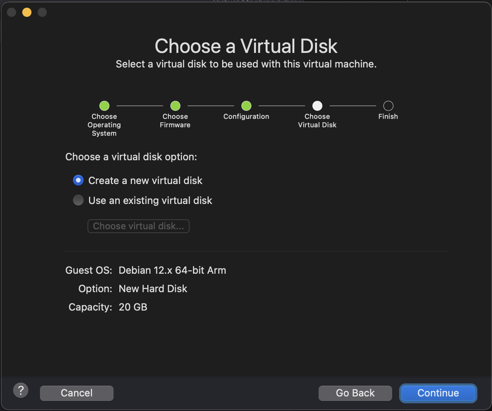
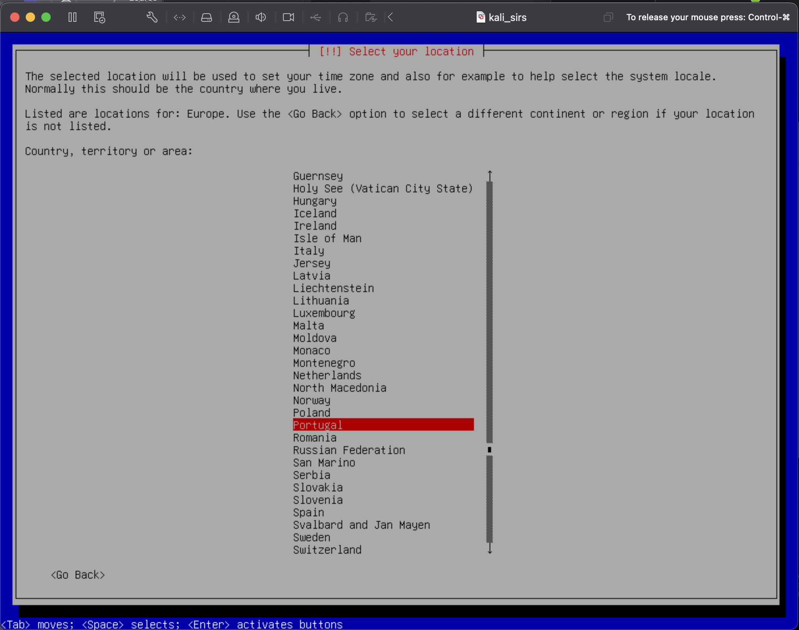
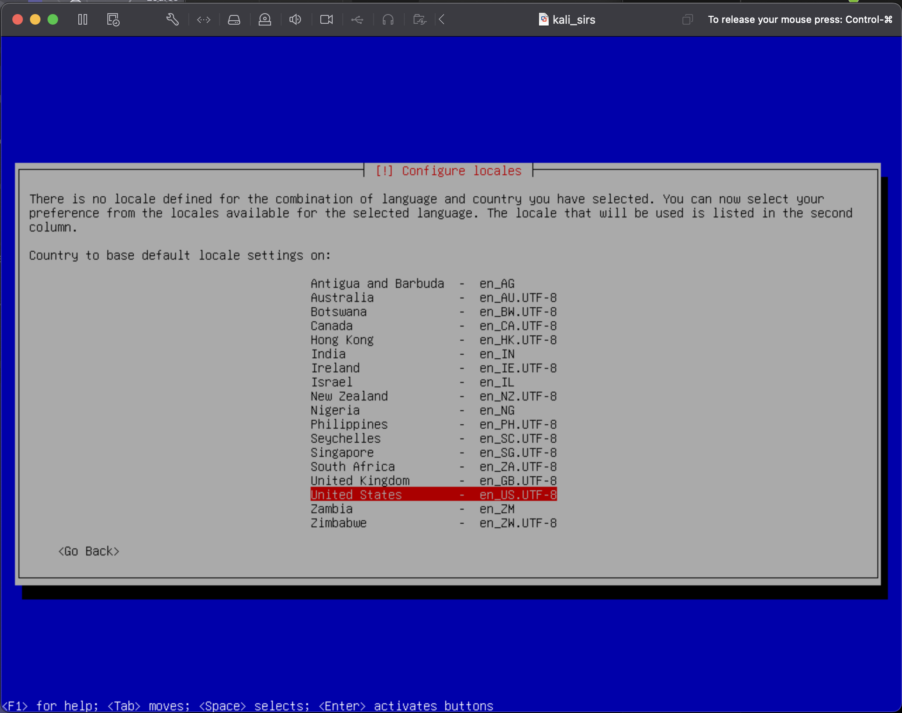
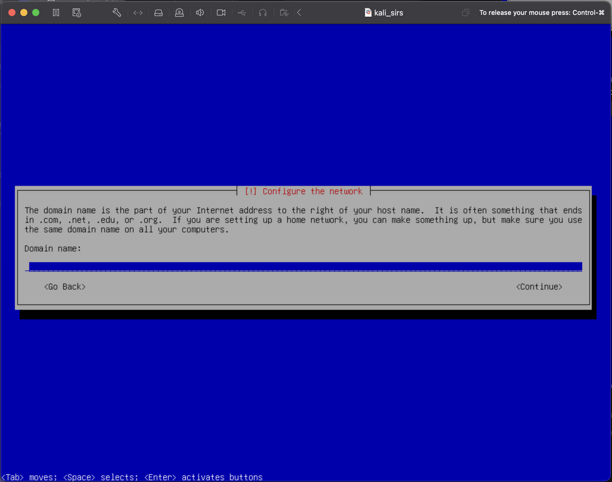
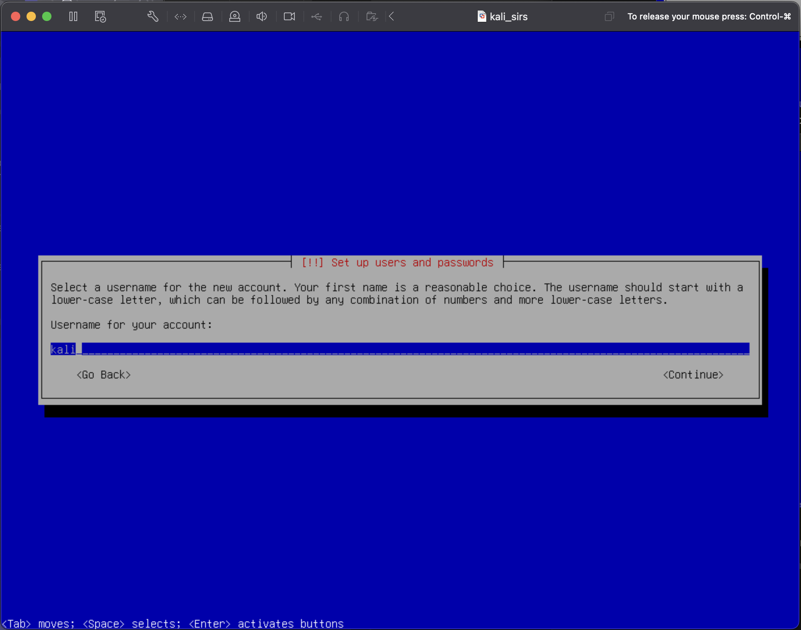
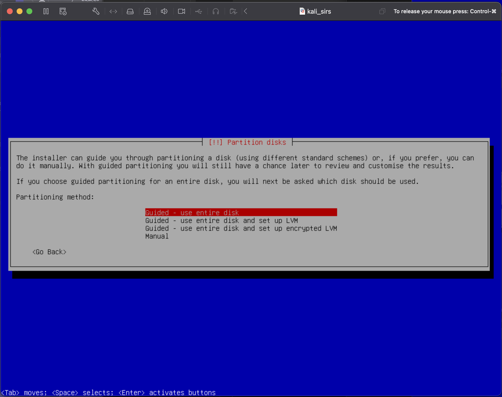
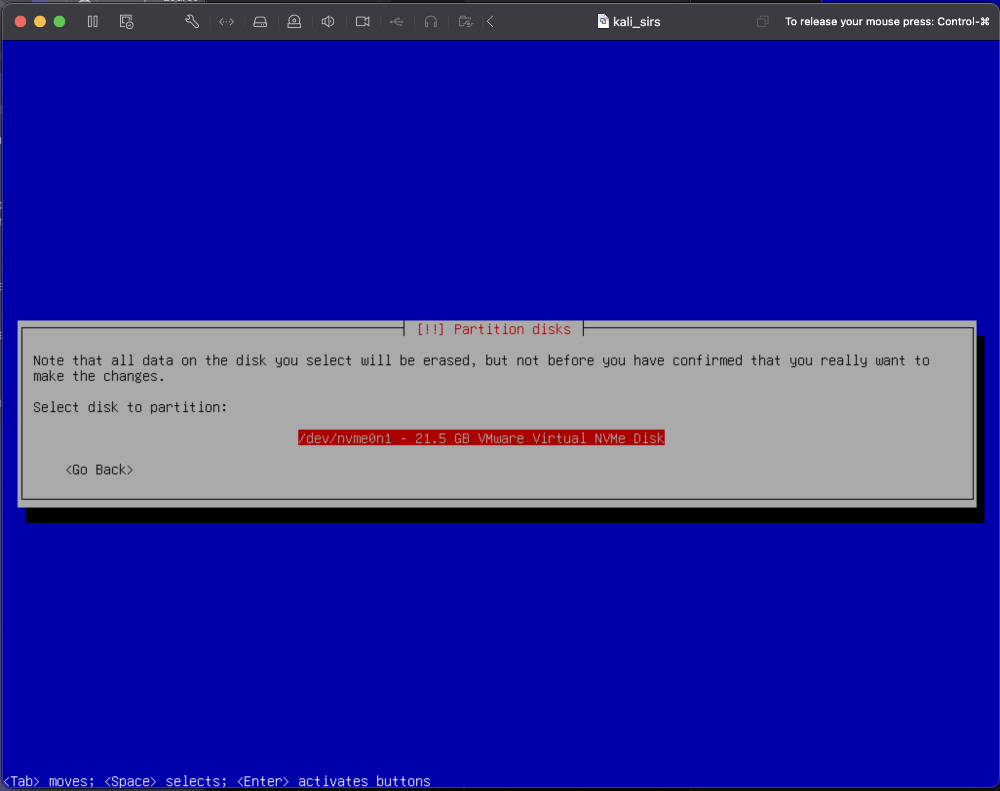
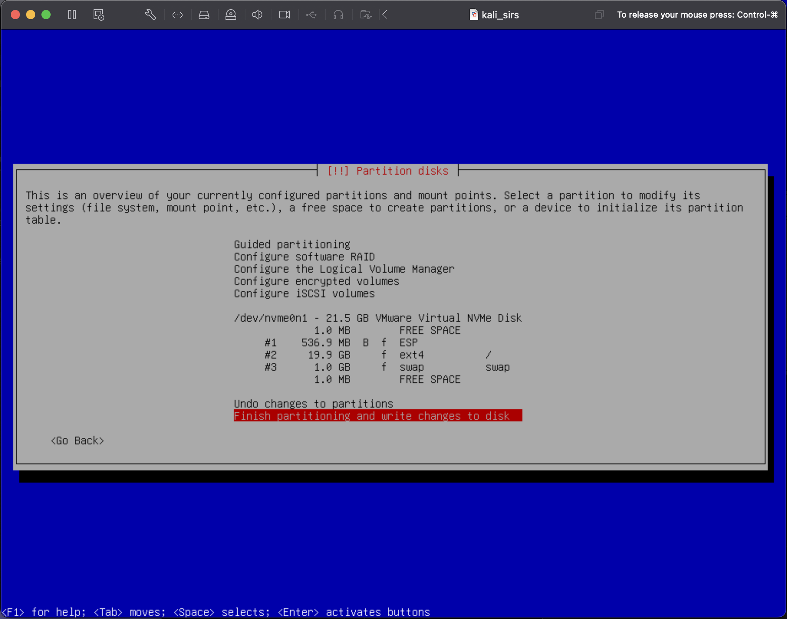
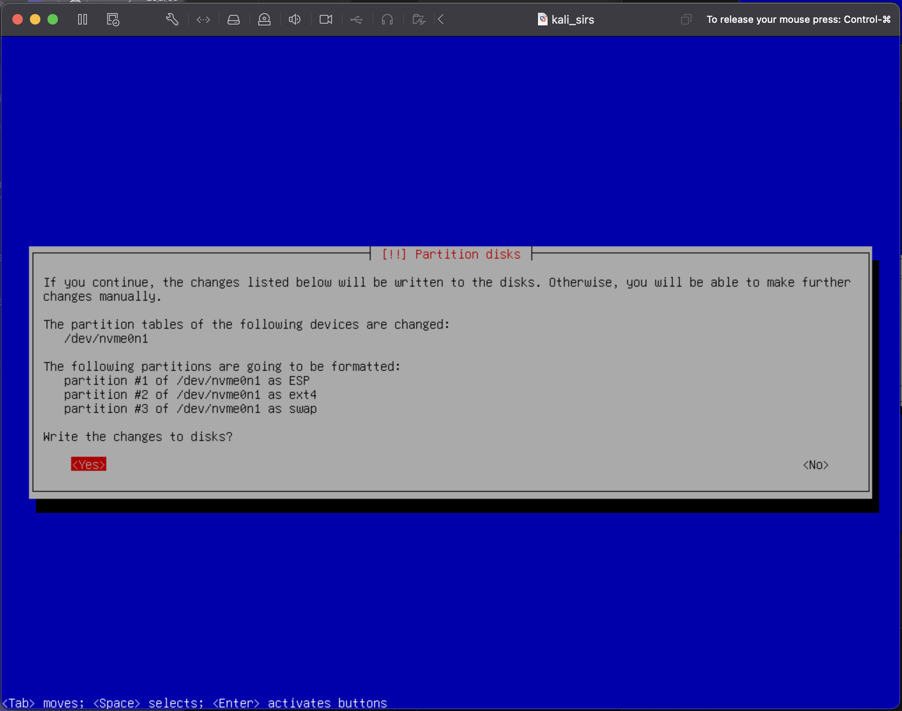
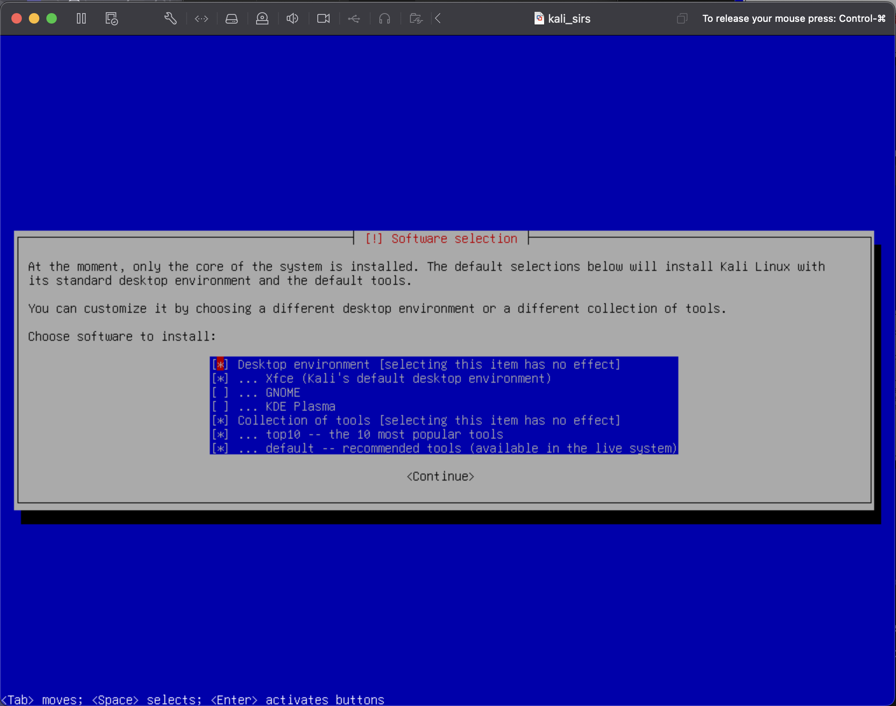

# VMWare Fusion 13 
## Installation and VM Setup Guide

This guide will walk you through the process of installing VMWare Fusion 13 and setting up a VM for the lab classes. This guide is intended for users of both Intel-based and Apple Silicon MacBooks, though there are some minor differences between the two, which will be noted when relevant.

### 1. Obtaining VMWare Fusion 13

VMWare allows anyone to obtain a personal-use license of VMWare Fusion 13, which is some of the most capable virtualization software currently available for macOS, with the added benefit of supporting Apple Silicon devices. Follow these steps to obtain a copy of VMWare Fusion 13.

- Visit [this page](https://customerconnect.vmware.com/en/evalcenter?p=fusion-player-personal-13) and select “Create an Account” to create a free VMWare account
- Complete your registration, and afterwards open the same link when logged in to reveal your license key (should be under the “License Information” section) and take note of it
- Under “Download Packages”, click “Manually Download” to obtain the binaries for VMWare Fusion 13.5.0 (the same package works for both Intel and Apple Silicon MacBooks)
- Open the downloaded binary and follow the instructions. When prompted, make sure to allow “Accessibility” permissions for VMWare Fusion 13
- Open VMWare Fusion for the first time and accept any permission prompts required for usage

### 2. Setting up a VM for the lab classes

There’s two ways to go about this. You can either download a pre-built VMWare image, which features a pre-configured instance of Kali Linux 2023.3 (section 2.1), or you can download a Kali Linux installer and configure the VM from scratch (section 2.2).

Using the pre-built VMs is easier, though you can always resort to installing Kali Linux on the VM from scratch if you run into any issues, which isn’t difficult to do either, it just takes slightly longer.

### 2.1. Creating a VM using the pre-built image

This section is largely similar for users of Intel-based and Apple Silicon MacBooks, with the only difference being the VMWare image to use.

<!-- TODO: INSERT VM IMAGE LINK -->
- For Apple Silicon MacBooks, you can use an image we’ve made available here. 
- For Intel-based MacBooks, you can use Kali’s own pre-built VMWare image, available [here](https://cdimage.kali.org/kali-2023.3/kali-linux-2023.3-vmware-amd64.7z).

Once you’ve downloaded your image, you should extract the compressed file to find a `.vmwarevm` file, which you should place at *<username>/Virtual Machines*. This folder should only exist if you've opened VMWare Fusion at least once. If you have trouble finding it, a good reference point is that it is a sibling folder of others such as *************Applications*************, *********Documents********* and *********Downloads*********.

After doing this, click the VMWare Fusion icon on the menu bar and click “Virtual Machine Library” to open the main VMWare Fusion window. Use the “Scan” option, as detailed below.

This should cause a new VM to show up on the list. Right-click it and hit “Start Up”. Some popups may appear now, and you should respond as follows.

- If you see a popup saying “This virtual machine appears to be in use”, click the “Take Ownership” button.
- When you see a popup saying “This virtual machine might have been moved or copied”, click the “I Copied It” option.

At this point, your VM should be ready to use, and you can log-in with the following credentials.

- Username: `kali`
- Password: `kali`

### 2.2.

This section is largely similar for users of Intel-based and Apple Silicon MacBooks, with the only difference being the OS installer to use.

- For Apple Silicon MacBooks, you should download the ARM64 installer, available [here](https://cdimage.kali.org/kali-2023.3/kali-linux-2023.3-installer-arm64.iso).
- For Intel-based MacBooks, you should download the AMD64 installer, available [here](https://cdimage.kali.org/kali-2023.3/kali-linux-2023.3-installer-amd64.iso).

When your ISO file is ready, follow these instructions to configure your VM.

1. Click the VMWare Fusion icon on the menu bar and click “Virtual Machine Library” to open the main VMWare Fusion window.
2. Create a new virtual machine.
    
    
    
3. Select “Install from disc or image” and continue.
    
    
    
4. At this point, you should drag your ISO file into this window or select it manually and continue.
5. Select “Linux”, “Debian 12.x 64-bit Arm” if you’re on Apple Silicon, or “Debian 12.x 64-bit” if you’re on an Intel-based MacBook and continue.
    
    
    
6. Select “Create a new virtual disk” and continue. The default is 20 GB, though this is a dynamic value, it won’t instantly allocate 20GB of space unless the VM uses that much space. It is also configurable later on.
    
    
    
7. Select “Finish”. At the saving screen, we recommend saving in the default location, which should the the “Virtual Machines” folder. You should change the default name to something such as “kali_sirs”.
    
    
    
8. Your VM should now be loading. Select the “Install” option using your keyboard.
    
    
    

The following options can be left to your desire, feel free to deviate from the guide as you need to.

1. After a while, you’ll be presented with a screen which allows you to select a language. For the purpose of this guide, we’ll select “English”
    
    
    
2. Select “Other”
    
    
    
3. Select “Europe”
    
    
    
4. Select “Portugal”
    
    
    
5. Select “United States”
    
    
    
6. Select “Portuguese”, depending on your keyboard layout, of course.
    
    
    

The following steps relate to creating users, and for this guide we’ll be creating a user named “kali” with password “kali”, though you’re free to change this.

1. Set your VMs hostname as “kali”, the default value.
    
    
    
2. You can omit the domain name, essentially skipping this option.
    
    
    
3. Username and password will be set to “kali” for this example.
    
    
    
    
    
4. Set your timezone as “Lisbon”
    
    
    
5. Select “Guided - use entire disk”, and for the following option, you should select the only existing disk, “VMWare Virtual NVMe Disk”
    
    
    
    
    
6. Select “All files in one partition”
    
    
    
7. Select “Finish partitioning” and confirm your changes by selecting “Yes”
    
    
    
    
    

After a short while, the installer should ask you which software you want.

1. For desktop environment, you should choose XFCE, Kali’s default.
    
    
    

As the installer prepares your Kali Linux instance, you’ll have to wait for a short while, around 10 minutes. 

1. Select “Continue” to finish the installation.
    
    
    
2. After a while, you should be presented with a login screen, in which you should use the details you previously configured. In the case of this guide, username “kali” and password “kali”.
3. Now, you can either power-off your VM (via the power menu within Kali), or simply click the cross to exit the VM’s window, which will suspend it. You can resume it anytime later on by right-clicking it and selecting “Resume” on the virtual-machine library.
    
## Troubleshooting

If you have any issues with this guide, due to the granularity myriad of possible issues, we urge you to search online for people with similar issues, as it is likely that you’ll find a solution to your problem.

For issues or any additional questions, please feel free to reach out to your labs instructor in-class, or to the faculty via e-mail.

----

[SIRS Faculty](mailto:meic-sirs@disciplinas.tecnico.ulisboa.pt)
